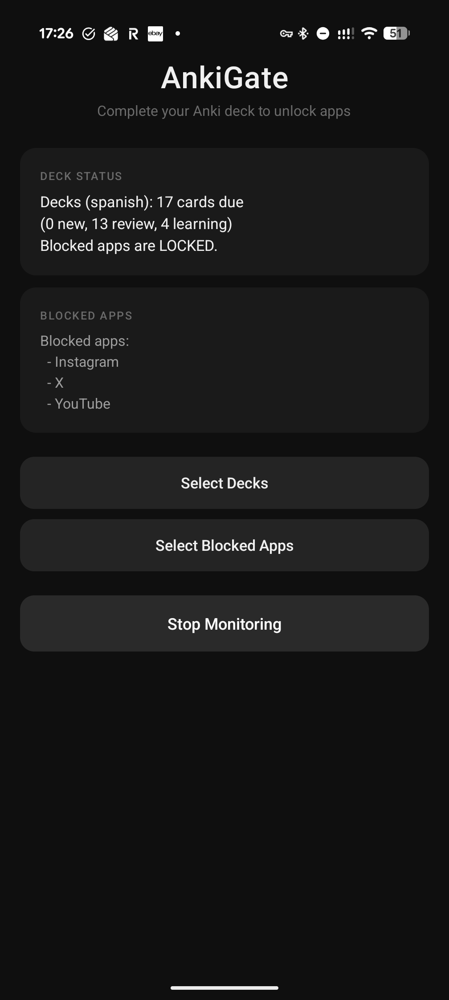
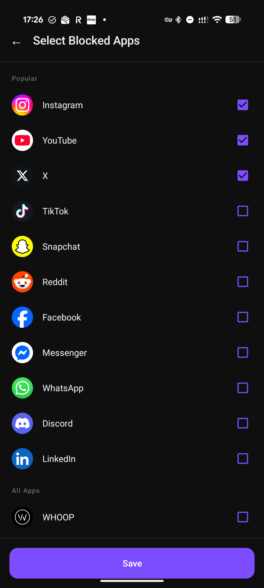
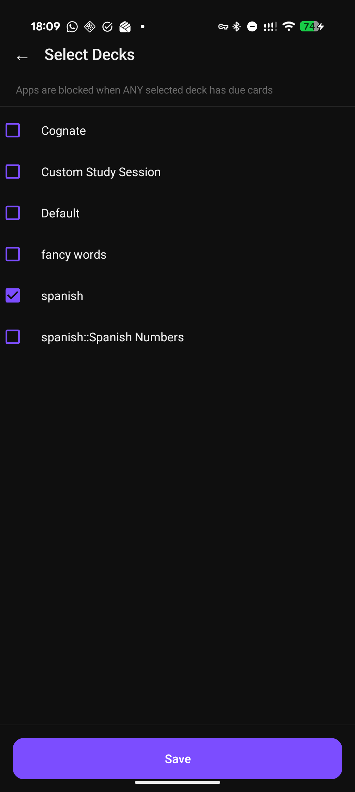

# AnkiGate

Block distracting apps until you finish your daily Anki reviews. Choose which decks to monitor and which apps to lock — once all due cards are done, everything unlocks automatically.

## Features

- **Configurable deck monitoring** — select any combination of your AnkiDroid decks
- **Configurable app blocking** — pick which apps to block from your full app list
- **Smart app list** — popular social media apps pinned at the top, everything else sorted by recent usage
- **Real-time status** — see due card counts and blocked app list at a glance
- **Auto-unlock** — apps unlock the moment all selected decks hit zero due cards
- **Auto-start** — monitoring resumes on device boot
- **Minimal and fast** — no internet, no accounts, no ads

## How It Works

1. A foreground service polls the foreground app every second via `UsageStatsManager`
2. When a blocked app is detected, it checks your selected AnkiDroid decks via the ContentProvider API
3. If any selected deck has cards due, a full-screen blocking activity launches with your card count and an "Open AnkiDroid" button
4. Once all selected decks are complete (0 new, 0 review, 0 learning), the apps unlock
5. When new cards appear the next day, blocking resumes

## Screenshots

<p align="center">
  
  &nbsp;&nbsp;
  
  &nbsp;&nbsp;
  
</p>

## Building

Requires JDK 17+ and the Android SDK (build-tools 36).

```bash
export JAVA_HOME=/path/to/jdk17
export ANDROID_HOME=~/Library/Android/sdk
./gradlew assembleDebug
```

The APK is output to `app/build/outputs/apk/debug/app-debug.apk`.

## Installation

```bash
# Install the APK
adb install -r app/build/outputs/apk/debug/app-debug.apk

# Grant permissions
adb shell appops set com.ankigate android:get_usage_stats allow
adb shell appops set com.ankigate SYSTEM_ALERT_WINDOW allow
adb shell pm grant com.ankigate android.permission.POST_NOTIFICATIONS
adb shell pm grant com.ankigate com.ichi2.anki.permission.READ_WRITE_DATABASE

# Whitelist from battery optimization
adb shell dumpsys deviceidle whitelist +com.ankigate

# Launch
adb shell am start -n com.ankigate/.MainActivity
```

Or install the APK directly on your device and grant permissions through system settings.

## Architecture

| File | Purpose |
|------|---------|
| `MonitorService.kt` | Foreground service that polls the foreground app and triggers blocking |
| `AnkiChecker.kt` | Queries AnkiDroid's ContentProvider for deck due counts |
| `BlockingActivity.kt` | Full-screen blocker shown when a blocked app is detected |
| `MainActivity.kt` | Status dashboard with service toggle and navigation |
| `DeckSelectionActivity.kt` | Multi-select picker for AnkiDroid decks |
| `AppSelectionActivity.kt` | App picker with icons, sorted by usage, social media pinned to top |
| `Prefs.kt` | SharedPreferences helper for persisting user selections |
| `BootReceiver.kt` | Restarts the monitoring service on device boot |

## Permissions

| Permission | Why |
|------------|-----|
| `PACKAGE_USAGE_STATS` | Detect which app is in the foreground |
| `SYSTEM_ALERT_WINDOW` | Launch blocking screen from background service |
| `FOREGROUND_SERVICE` | Keep the monitoring service alive |
| `POST_NOTIFICATIONS` | Foreground service notification |
| `RECEIVE_BOOT_COMPLETED` | Auto-start on boot |
| `com.ichi2.anki.permission.READ_WRITE_DATABASE` | Read deck due counts from AnkiDroid |

## Requirements

- Android 9+ (API 28)
- [AnkiDroid](https://play.google.com/store/apps/details?id=com.ichi2.anki) installed with at least one deck

## License

MIT
